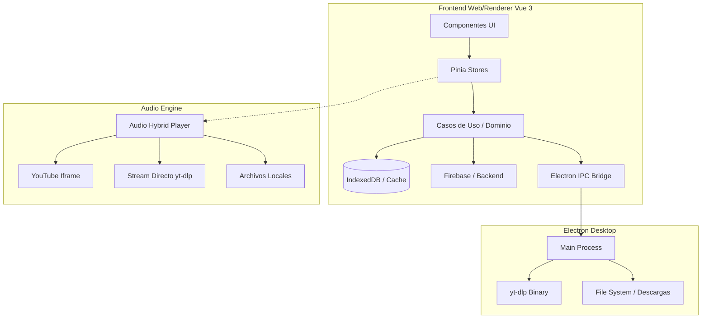

# Documento Maestro de Arquitectura y Consultoría Estratégica: JearCast Player

**Fecha:** Septiembre 2026  
**Proyecto:** JearCast Player (v3.1)  
**Objetivo:** Auditoría técnica, análisis de escalabilidad, revisión de infraestructura Cloud y evaluación de riesgos legales y de monetización.

---

## 1. Arquitectura General del Software

JearCast Player se consolida como un ecosistema híbrido robusto, combinando tecnologías web modernas con las capacidades nativas del escritorio. La arquitectura está diseñada en torno a la separación de responsabilidades (Clean Architecture / DDD), lo que facilita la mantenibilidad y la escalabilidad de la base de código.

### 1.1. Frontend: Vue 3 + TypeScript + Vite + Pinia (v3.1)
El cliente principal adopta un enfoque basado en capas inspirado en **Domain-Driven Design (DDD)** y **Clean Architecture**:

*   **Capa de Presentación (Presentation):** 
    *   **Layouts y Páginas:** La UI se estructura en vistas principales (`Home`, `Artists`, `Playlists`, `Recommended/Topics`, `Favorites`, `LocalMusic`, `Settings`).
    *   **Composables:** Lógica reactiva reutilizable (ej. `useAudioPlayer`, `useSync`).
    *   **Pinia Stores:** Manejo del estado global de la aplicación. Centralizan el estado del reproductor (`player`), la cola de reproducción y los datos del usuario (`userDataStore`, `artistStore`, `topicsStorageService`).
*   **Capa de Dominio (Domain):** Define las entidades del negocio (ej. `Track`, `Playlist`, `Artist`) y las interfaces de los repositorios, agnósticas a la tecnología subyacente.
*   **Capa de Datos (Data):** Implementa las interfaces del dominio, interactuando con APIs externas, Firebase, bases de datos locales (`IndexedDB` / `localStorage`) y el puente IPC de Electron.

### 1.2. Integración de Audio (Reproductor Híbrido)
El motor de reproducción es el núcleo de JearCast, operando bajo un modelo híbrido para maximizar la compatibilidad y el rendimiento:
1.  **Iframe YouTube API:** Método fallback y oficial para reproducir contenido directamente desde los servidores de YouTube.
2.  **Audio Stream Directo (yt-dlp):** Extracción del flujo de audio puro en alta calidad, consumido mediante el elemento `<audio>` nativo o procesado.
3.  **Reproducción Local:** Soporte para archivos `.mp3`, `.flac`, etc., alojados en el dispositivo del usuario.
4.  **AudioContext / Web Audio API:** Permite la manipulación avanzada del sonido (ej. ecualizadores, analizadores de espectro, normalización de volumen).

### 1.3. Electron Desktop (jearcastapp_electron_v3)
El empaquetado de escritorio provee acceso al sistema operativo de manera segura:
*   **Main Process:** Actúa como el "backend" local. Orquesta la ejecución de subprocesos (ej. binarios de `yt-dlp`), gestión del sistema de archivos y control de ventanas.
*   **Preload Script:** Expone una API segura (Context Bridge) al proceso de renderizado (Vue), asegurando el aislamiento (Sandbox) y previniendo vulnerabilidades XSS.
*   **IPC Handlers:** Canales de comunicación bidireccional asíncrona para tareas pesadas:
    *   Búsqueda y extracción de metadatos mediante `yt-dlp`.
    *   Descarga de canciones y gestión de caché local.
    *   Streaming de audio bypass y controles de hardware (teclas multimedia).

---

## 2. Estado Actual de Firebase y Costos a Gran Escala

Actualmente, JearCast aprovecha Firebase para funcionalidades en la nube (Firestore para sincronización, Auth para identidad y Storage para recursos).

### 2.1. Análisis de Costos y Escalabilidad
Firebase opera bajo un modelo *pay-as-you-go*. Si bien es económico para prototipos, los costos se disparan a escala:
*   **1,000 Usuarios:** La capa gratuita (50k lecturas/día) suele ser suficiente si la app es muy eficiente. Costo estimado: $0 - $5/mes.
*   **10,000 Usuarios:** Si cada usuario sincroniza listas y favoritos generando ~100 lecturas diarias (1M lecturas/día), el costo solo en base de datos superaría los $15 - $20/mes, más costos de salida de red (egress) en Storage.
*   **50,000 Usuarios:** A este nivel, las lecturas (5M/día) y escrituras pueden costar cientos de dólares mensuales ($100 - $300+/mes). El ancho de banda de Firebase Storage ($0.12/GB de egress) se vuelve el gasto más crítico si se sirven imágenes de portadas o archivos grandes desde allí.

### 2.2. Evaluación de la Arquitectura "Local-First"
JearCast ha mitigado estos riesgos brillantemente con una arquitectura **Local-First** (IndexedDB / localStorage / Cache API):
*   **Ventaja Competitiva:** La app funciona perfectamente offline. Firebase actúa solo como un motor de sincronización secundaria (sync worker) y no como la fuente de verdad en tiempo real.
*   **Ahorro de Costos:** Al leer de la caché local e implementar estrategias de sincronización en segundo plano (ej. *debouncing* o *batching* de escrituras a Firestore), los costos de Firebase se reducen dramáticamente.

---

## 3. Alternativas a Firebase (Consultoría de Migración)

Para un ecosistema con 50-60 usuarios actuales, migrar el backend en este momento es técnicamente viable y altamente recomendado para blindar la rentabilidad futura.

### 3.1. Ecosistema Cloudflare (D1, R2, Workers)
La alternativa más moderna y escalable a nivel de costos.
*   **Cloudflare D1 (SQLite en el Edge):** Base de datos relacional ultrarrápida. Ofrece 5 millones de lecturas diarias y 100,000 escrituras diarias en su capa **gratuita**.
*   **Cloudflare R2 (Object Storage):** Compatible con la API de Amazon S3. Su mayor ventaja: **$0 por ancho de banda de salida (Egress gratuito)**. Es ideal para almacenar carátulas de álbumes y recursos sin miedo a picos de tráfico.
*   **Workers / Pages:** Backend serverless ultrabarato ($5/mes por 10 millones de peticiones).

### 3.2. Supabase (El "Firebase de Código Abierto")
*   Base de datos PostgreSQL real y robusta.
*   Capa de autenticación (Auth) excelente, con soporte nativo para Google OAuth y Email/Password, sin los límites arbitrarios de Firebase.
*   Almacenamiento y APIs (REST/GraphQL) automáticas. Su capa gratuita aloja perfectamente a 10,000+ usuarios con un diseño Local-First.

### 3.3. PocketBase
*   Backend "todo en uno" en un solo archivo ejecutable (Go + SQLite).
*   Se puede alojar en un VPS barato (ej. Hetzner, Fly.io, DigitalOcean) por **$3 a $5 USD al mes**, soportando a decenas de miles de usuarios concurrentes gracias a la eficiencia de Go.
*   Perfecto para desarrolladores independientes que desean control total sobre sus datos sin vendor lock-in.

**Veredicto de Migración:**
Dada la arquitectura de JearCast, **Supabase** es la transición más natural desde Firebase debido a sus SDKs similares. Sin embargo, si se busca minimizar costos a $0 en recursos estáticos, migrar el Storage a **Cloudflare R2** es mandatorio.

---

## 4. Análisis Legal, Técnico y de Monetización (YouTube / yt-dlp)

Este es el aspecto de mayor riesgo para el proyecto. Construir un modelo de negocio sobre infraestructuras de terceros no autorizadas requiere una estrategia legal y de pagos muy cuidadosa.

### 4.1. Implicaciones Legales (Términos de Servicio de YouTube)
*   **Violación de ToS:** Las secciones II.8 y III.E de los Términos de Servicio de YouTube prohíben explícitamente:
    1.  Separar el audio del video.
    2.  Reproducir contenido en segundo plano (background play) evadiendo su modelo premium.
    3.  Evadir, bloquear o alterar los anuncios publicitarios.
*   `yt-dlp` realiza estas tres acciones por diseño. Aunque JearCast no aloja la música (evitando infracciones directas de copyright de distribución), facilita la evasión de los mecanismos comerciales de Google.

### 4.2. Riesgos con Pasarelas de Pago
*   **Stripe, PayPal, MercadoPago:** Tienen políticas estrictas contra negocios que violan derechos de propiedad intelectual o términos de grandes plataformas (DMCA).
*   **El Riesgo:** Si promocionas JearCast como "una app para escuchar música de YouTube gratis y sin anuncios", tu cuenta de Stripe/PayPal será congelada eventualmente, reteniendo los fondos.

### 4.3. Riesgo de Mantenimiento Técnico (El juego del Gato y el Ratón)
*   YouTube cambia constantemente sus firmas criptográficas (`n-token`), añade protecciones de BotGuard, e impone bloqueos de IP (Error 429 Too Many Requests).
*   Esto significa que la app "se romperá" periódicamente. Cobrar a un usuario por un servicio que depende de `yt-dlp` genera altas expectativas; cuando YouTube cambie la API, tendrás usuarios enojados exigiendo reembolsos mientras esperas que la comunidad de `yt-dlp` lance un parche.

### 4.4. Modelos de Monetización Legales y Viables

Para monetizar JearCast mitigando el riesgo de bloqueos financieros o demandas, **NUNCA debes cobrar por el acceso a la música**. Debes cobrar por la "Infraestructura del Software" y las "Herramientas de Productividad".

*   **Modelo A: "JearCast Pro / Cloud" (SaaS):**
    *   La app base es 100% gratuita y Open Source/Freeware.
    *   El usuario paga una suscripción ($1.99 - $3.99/mes) por características de valor agregado: **Sincronización multi-dispositivo en la nube, copias de seguridad automáticas, ecualizador paramétrico premium, temas visuales exclusivos, integraciones avanzadas**. El pago es por "almacenamiento en la nube y personalización", no por la música.
*   **Modelo B: Licencia de Software de Pago Único (Shareware):**
    *   Se vende la versión de escritorio de Electron (ej. $10 - $15 USD pago único) como una herramienta de software productivo, similar a cómo se venden gestores de descargas (IDM) o reproductores de nicho.
*   **Modelo C: Economía de Creador (Donaciones/Patrocinios):**
    *   Usar plataformas como Patreon, Ko-fi o GitHub Sponsors.
    *   Los donadores reciben acceso anticipado a versiones beta, insignias en la app, o voto directo en el roadmap de desarrollo. Este es el modelo de menor riesgo legal.

### 4.5. Aprovechamiento del Dominio `.lat`
El dominio `.lat` otorga una fuerte identidad orientada a Latinoamérica.
*   **Estrategia:** Convertir `jearcast.lat` en el portal oficial de distribución y validación de licencias.
*   Crear una *Landing Page* institucional y limpia (usando Vitepress o Astro) que posicione a JearCast como un "reproductor multimedia local avanzado", evitando mencionar abiertamente "YouTube sin anuncios" en la página principal de ventas para proteger la pasarela de pagos.

---
**Conclusión:**
JearCast v3.1 posee una base tecnológica excepcional y moderna. La arquitectura "Local-First" es su mayor fortaleza técnica. El siguiente paso evolutivo es migrar de Firebase a alternativas más escalables (Supabase/Cloudflare) para blindar los costos de infraestructura, y adoptar un modelo de monetización lateral ("Freemium de Herramientas", no de contenido) para proteger el proyecto de bloqueos legales y de pasarelas de pago.
